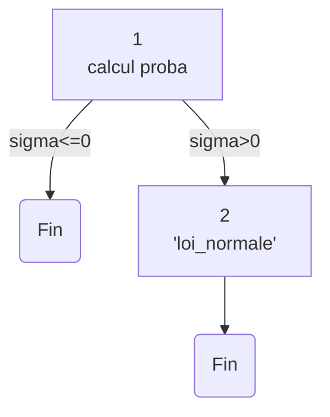

## Dossier de Tests Proba

### **Introduction:** Ce document à pour objectif de référencer les tests réalisés pour le module de probabilité de notre application. 
 

### **Description de la procédure des tests:** Pour ce module, trois paramètres sont pris en compte; moyenne, écart type, probabilité. L’algorithme agit de différentes manières selon la valeur renseignée, certaines sont ‘interdites’ (division par zéro). Nous effectuerons des tests de type boite noire et boite blanche afin de tester la vérification des paramètres, et le bon fonctionnement des calculs Nous testerons les différentes méthodes de calcul avec trois valeur de **𝞂**. Seul la méthode **norm(m,s,x)** sera testée avec un set d'une valeur, puisque celle ci sont forcément positive. Elle sont vérifiées préalablement par une des méthodes citées précedemment.     
 

### **Tests:** Pour ces tests, nous allons déterminer les partitions d’équivalences suivantes:
> partition 1 = **]-inf;0]** et partition 2 = **]0;+inf[**

L’écart type ‘sigma’ étant le seul élément sous condition, les seuls cas testés pour les tests unitaires seront pour **𝞂 ∈ partition 1** et **𝞂 ∈ partition 2**. Pour les tests d'intégrations, nous réaliserons les tests unitaires précédents avec un nouveau paramètre qu’est le chemin d’accès: il sera relatif, absolu ou invalide. Nous choisissons de réaliser ces tests sur la méthode “rectangle médians” implémentée comme “méthode des trapèzes” et “méthode de simpson”
 
 

## Test Boite Blanche

Le schéma suivant s'applique au trois méthodes de calcul 

*Schéma des chemins test boite blanches*

### chemins possibles :

>C1: {1};
>C2: {1,2};

|Chemin|sortie|
| - | - |
|C1|erreur|
|C2|0<t<1|
*Tableau des cas de test*

|Chemin|sortie|OK/KO|
| - | - | - |
|C1|erreur|OK|
|C2|0<t<1|OK|
*Tableau des résultats de test*
 

## Test boite Noire

|Classe|m|𝞂|t|résultat attendu|
| - | - | - | - | - |
| p1 | >0 | >0 | >0 | 0<t<1 |
*Tableau de Tests unitaires **norm(m,s,x)***

|Classe|m|𝞂|t|résultat attendu|
| - | - | - | - | - |
| p1 | >0 | >0 | >0 | 0<t<1 |
|p2|>0|<0|>0|erreur|
|p3|>0|=0|>0|erreur|
*Tableau de Tests unitaires (pour toute les méthodes)*

|Classe|path|m|𝞂|t|résultat attendu|
| - | - | - | - | - | - |
|p1|absolut|>0|>0|>0|0<t<1|
|p2|relatif|>0|>0|>0|0<t<1|
|p3|erroné|>0|>0|>0|erreur|
|p4|absolut|>0|<0|>0|erreur|
|p5|relatif|>0|<0|>0|erreur|
|p6|erroné|>0|>0|>0|erreur|
|p7|absolut|>0|=0|>0|erreur|
|p8|relatif|>0|=0|>0|erreur|
|p9|erroné|>0|=0|>0|erreur|
*Tableau de Tests intégration **rectangles_médiants(m,s,x)***

### Résultat de Tests:

|Classe|m|𝞂|t|résultat attendu|
| - | - | - | - | - |
| p1 | 90 | 3 | 87 | 0.0807 |
*Tableau de Tests unitaires **norm(m,s,x)** *

|Classe|m|𝞂|t|résultat attendu|
| - | - | - | - | - |
|p1|90|3|87|0,1582|
|p2|90|-3|87|valeur interdite|
|p3|90|0|87|valeur interdite|
*Tableau de Tests unitaires **rectangles_médiants(m,s,x)***

|Classe|m|𝞂|t|résultat attendu|
| - | - | - | - | - |
|p1|90|3|87|0,1587|
|p2|90|-3|87|valeur interdite|
|p3|90|0|87|valeur interdite|
*Tableau de Tests unitaires **trapèze(m,s,x)***

|Classe|m|𝞂|t|résultat attendu|
| - | - | - | - | - |
|p1|90|3|87|0,1582|
|p2|90|-3|87|valeur interdite|
|p3|90|0|87|valeur interdite|
*Tableau de Tests unitaires **simpson(m,s,x)***

|Classe|path|m|𝞂|t|résultat attendu|
| - | - | - | - | - | - |
|p1|absolut|90|3|87|0,1582|
|p2|relatif|90|3|87|0,1582|
|p3|erroné|90|3|87|erreur|
|p4|absolut|90|-3|87|valeur interdite|
|p5|relatif|90|-3|87|valeur interdite|
|p6|erroné|90|-3|87|erreur|
|p7|absolut|90|0|87|valeur interdite|
|p8|relatif|90|0|87|valeur interdite|
|p9|erroné|90|0|87|erreur|
*Tableau de Tests intégration **rectangles_médiants(m,s,x)***

