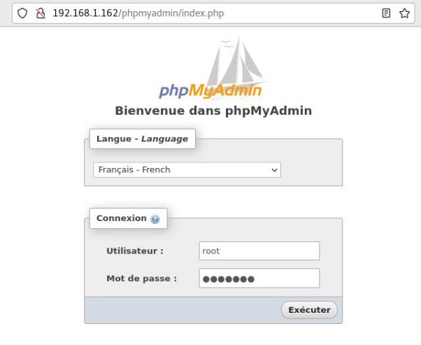

Nous avons mis en place une pile LAMP (Linux, Apache, Mysql, PHP) Pour Apache2:

Nous avons installé Apache, le serveur utilisé:

Ensuite nous avons créé un dossier qui contiendra les fichiers php. Nous devons donc installer le module php:

Pour Mysql;

Nous installons dans un premier temps mySQL, le système de base de donnée:

Afin de sécuriser la base de donnée nous définissons un mot de passe administrateur:

Nous avons décidé d’utiliser l’interface phpMyAdmin afin de gérer notre base de données plus aisément:

Nous choisissons d'exécuter phpMyAdmin sur notre serveur Apache. Pour cela nous devons finaliser la configuration du serveur:

Nous modifions alors le fichier de config, pour y intégrer phpMyAdmin:

Le serveur doit ensuite être redémarré:

Afin de nous connecter, nous devons au préalable créer un utilisateur possédant les droits administrateur pour phpMyAdmin

Nous pouvons ensuite accéder à cette interface via l’adresse suivante:

**http://192.168.1.162/phpmyadmin/**

